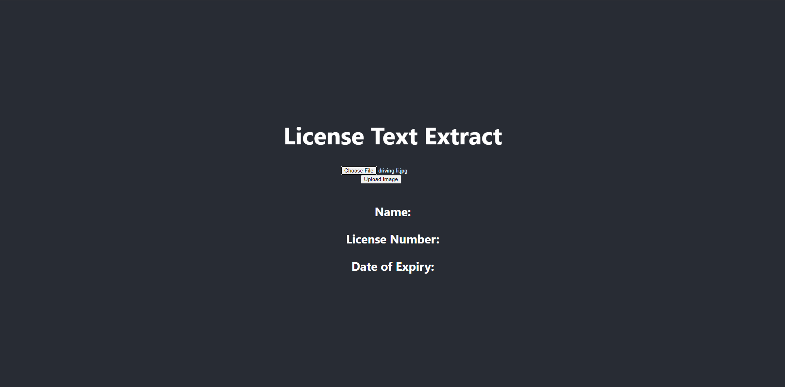
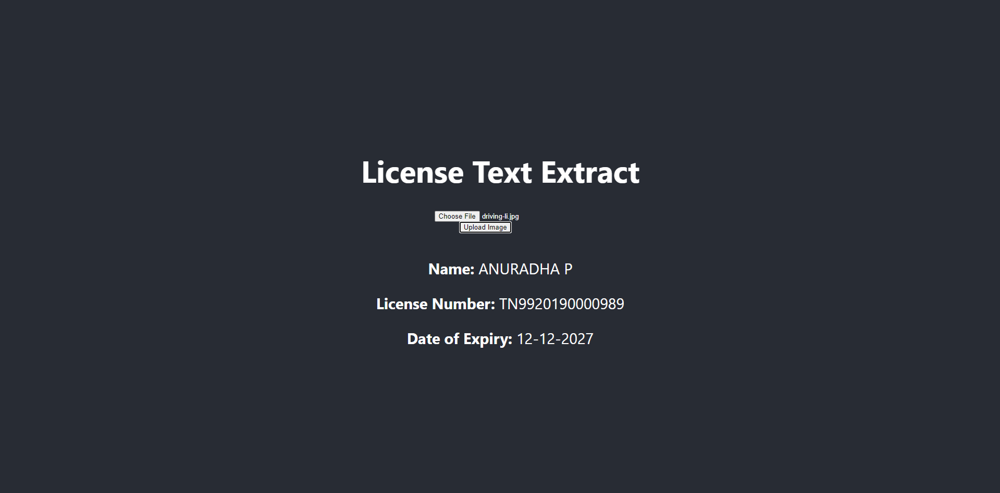

# Text Extraction From Driving License

# FRONT-END

React JS is used for creating the front-end. Front end has a simple UI which takes in the driving license image(jpg/jpeg file) and then sends it to the backend. After the data is processed and necessary data is extracted, the data is send to the front-end and then it is displayed.

## Instructions to run Front-End

1. Install all the required packages using `npm install`
2. Run the project using `npm start`
3. Go to the project url that is displayed in the terminal.
4. Upload the image and wait for a few seconds for the text to get extracted and GEMINI api to get called. Once the data is returned, the front-end will display the name, license number and the date of expiry.

#

**Front-End**

#

**Test License Used Source:Google**

#

**Front-End with Picture of License uploaded**

#

**Front-end Updated with Data received From Backend**

